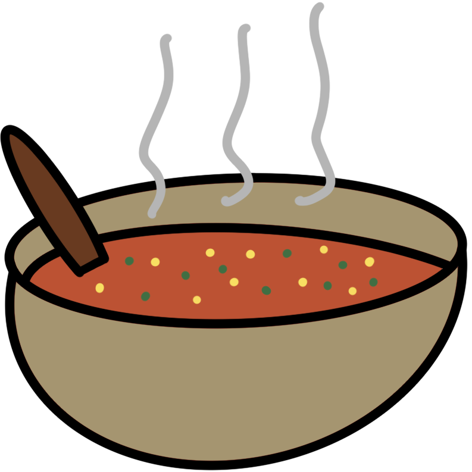
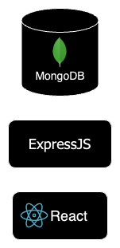
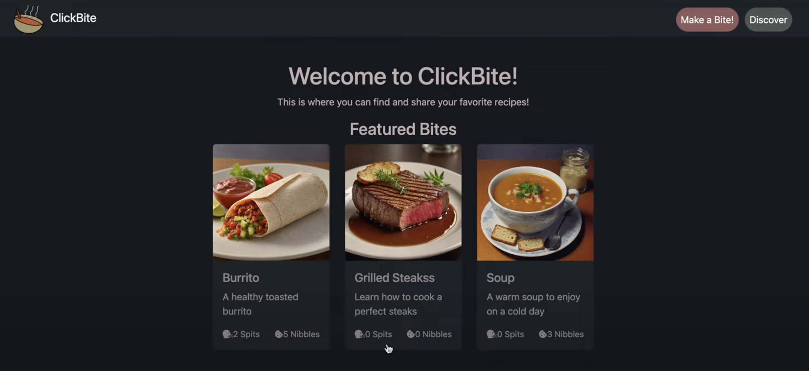

#  ClickBite 
An open platform for sharing recipes online.

## Design
An API build with ExpressJS delivers the data from MongoDB to the Front-end which is a React App.'

## Bites

Bites are the main product of this project. They are the recipes that can be easily distriuted as every Bite posted is public and does not require a log in to view.

Bites contain:
- Title
- Description
- Ingredients
- Steps (Instructions)
- An Image URL
- Nutritional Information

# Preview

    
## Resources:

- [MERN Stack Explained](https://www.mongodb.com/mern-stack)
- [MongoDB Docs](https://www.mongodb.com/docs/)
- [ExpressJS Docs](https://expressjs.com/en/4x/api.html)
- [ReactJS Docs](https://react.dev/reference/react)
- [NodeJS Docs](https://nodejs.org/docs/latest/api/)

